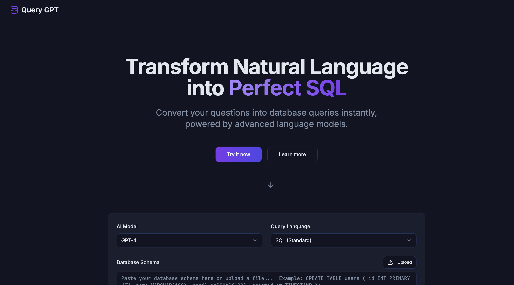
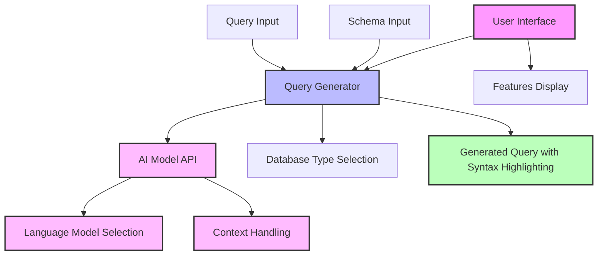

# Query GPT



> Convert natural language to SQL queries instantly with AI

## Overview

Query GPT is a modern web application that transforms natural language questions into SQL and NoSQL database queries using advanced language models. The application provides an intuitive interface for generating queries across multiple database systems and offers features like syntax highlighting, schema analysis, and easy query sharing.

## Live Demo

**🔗 [Try Query GPT Online](https://query-gpt.com/)**

Experience the tool directly in your browser without any installation.

## Table of Contents

- [Project Architecture](#project-architecture)
- [Technology Stack](#technology-stack)
- [Core Features](#core-features)
- [AI Capabilities](#ai-capabilities)
- [Getting Started](#getting-started)
- [Key Components](#key-components)
- [Project Structure](#project-structure)
- [Contributing](#contributing)

## Project Architecture



## Technology Stack

| Category | Technologies |
|----------|--------------|
| **Frontend Framework** | React, TypeScript |
| **Build Tool** | Vite |
| **Styling** | TailwindCSS, Shadcn UI |
| **State Management** | React Hooks, Context API |
| **Data Fetching** | TanStack Query (React Query) |
| **Routing** | React Router |
| **UI Components** | Radix UI, Lucide React icons |
| **Form Handling** | React Hook Form, Zod validation |
| **AI Integration** | OpenRouter API, LLM prompting |
| **Developer Tools** | ESLint, TypeScript |

## Core Features

- 🤖 **AI-Powered Query Generation**: Transforms natural language to SQL using advanced LLMs
- 🗄️ **Multi-Database Support**: Generates queries for SQL, MySQL, PostgreSQL, SQL Server, SQLite, and MongoDB
- 🔍 **Schema Analysis**: Interprets database schemas to create accurate queries
- ✨ **Syntax Highlighting**: Displays generated queries with code highlighting
- 📱 **Responsive Design**: Works seamlessly across desktop and mobile devices
- 🔄 **Preferences Saving**: Remembers your model and language preferences
- 📋 **One-Click Copy**: Easy sharing of generated queries

## AI Capabilities

- **Multiple LLM Support**: Integrate with various language models through OpenRouter
- **Context-Aware Queries**: Generate database queries that understand table relationships and schema context
- **Intelligent Schema Analysis**: AI analyzes provided schemas to generate accurate and optimized queries
- **Natural Language Understanding**: Process complex questions and convert them to precise database queries
- **Query Optimization**: Suggestions for query performance improvements based on schema analysis
- **Model Selection**: Choose from different AI models based on your specific needs and performance requirements
- **Prompt Engineering**: Optimized prompts for generating accurate SQL and NoSQL queries
- **Real-time Generation**: Fast response times for an interactive query development experience

## Getting Started

If you want to work locally using your own IDE, you can clone this repo and push changes.

The only requirement is having Node.js & npm installed - [install with nvm](https://github.com/nvm-sh/nvm#installing-and-updating)

Follow these steps:

```sh
# Step 1: Clone the repository using the project's Git URL.
git clone <YOUR_GIT_URL>

# Step 2: Navigate to the project directory.
cd <YOUR_PROJECT_NAME>

# Step 3: Install the necessary dependencies.
npm i

# Step 4: Create a .env file based on .env.example and add your OpenRouter API key.
cp .env.example .env
# Edit .env and add your OpenRouter API key (get one from https://openrouter.ai/keys)

# Step 5: Start the development server with auto-reloading and an instant preview.
npm run dev
```

## Key Components

| Component | Purpose | File Location |
|-----------|---------|---------------|
| **QueryGenerator** | Core query generation functionality | `src/components/QueryGenerator.tsx` |
| **SchemaInput** | Database schema input interface | `src/components/SchemaInput.tsx` |
| **QueryInput** | Natural language question input | `src/components/QueryInput.tsx` |
| **CodeDisplay** | Syntax highlighted query display | `src/components/CodeDisplay.tsx` |
| **ModelSelector** | AI model and DB type selection | `src/components/ModelSelector.tsx` |
| **AIProvider** | Manages AI model connections and context | `src/providers/AIProvider.tsx` |
| **Hero** | Main landing section | `src/components/Hero.tsx` |
| **Features** | Feature showcase section | `src/components/Features.tsx` |

## Project Structure

```
query-gpt/
├── src/                     # Source code
│   ├── components/          # React components
│   │   ├── ui/              # UI component library (Shadcn)
│   │   ├── QueryGenerator.tsx  # Main query generation component
│   │   └── ...              # Other components
│   ├── hooks/               # Custom React hooks
│   │   ├── useAIModel.ts    # Hook for AI model management
│   │   └── ...              # Other hooks
│   ├── lib/                 # Utility functions and helpers
│   │   ├── ai/              # AI-related utilities and API clients
│   │   └── ...              # Other utilities
│   ├── pages/               # Page components
│   └── App.tsx              # Main application component
├── public/                  # Static assets
├── index.html               # HTML entry point
├── vite.config.ts           # Vite configuration
├── tailwind.config.ts       # Tailwind CSS configuration
└── package.json             # Project dependencies and scripts
```

## Contributing

Contributions are welcome! Please feel free to submit a Pull Request.

1. Fork the repository
2. Create your feature branch (`git checkout -b feature/amazing-feature`)
3. Commit your changes (`git commit -m 'Add some amazing feature'`)
4. Push to the branch (`git push origin feature/amazing-feature`)
5. Open a Pull Request